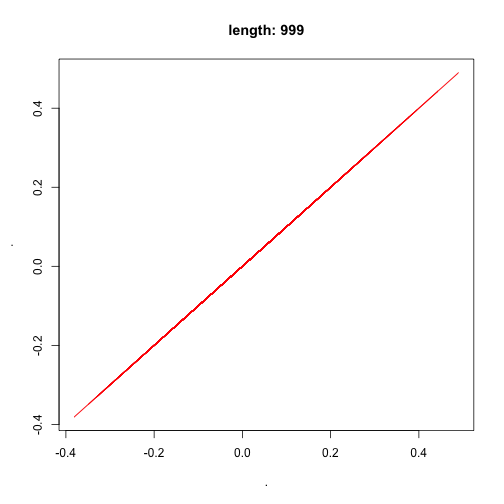
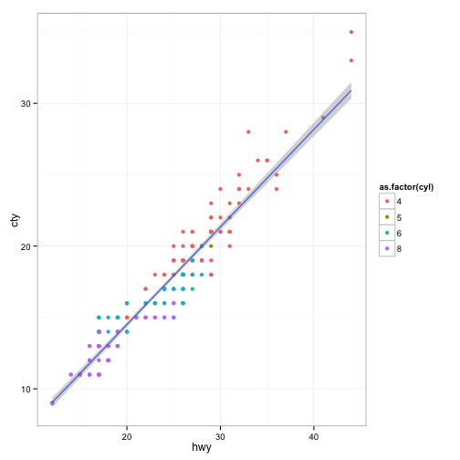
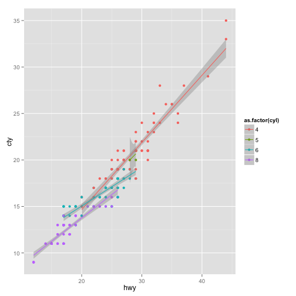
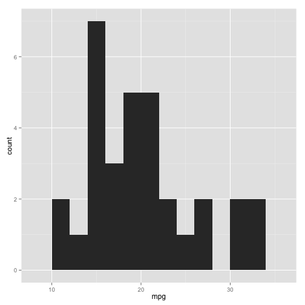
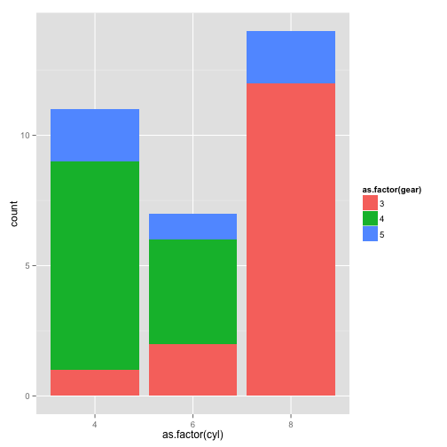
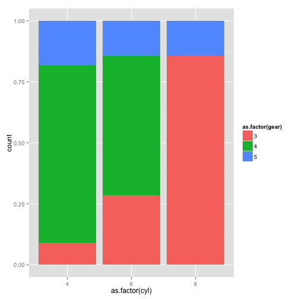
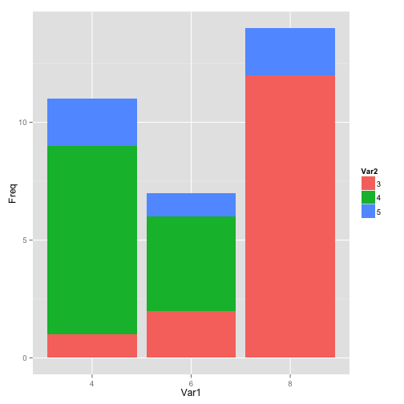
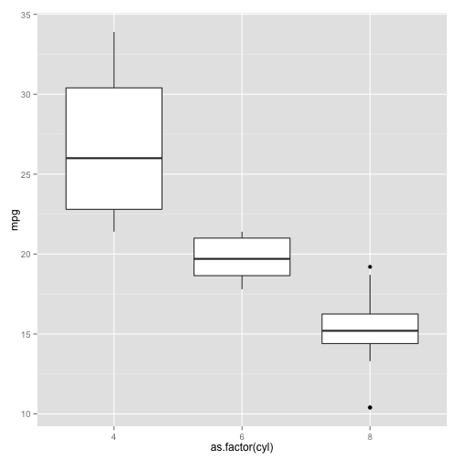
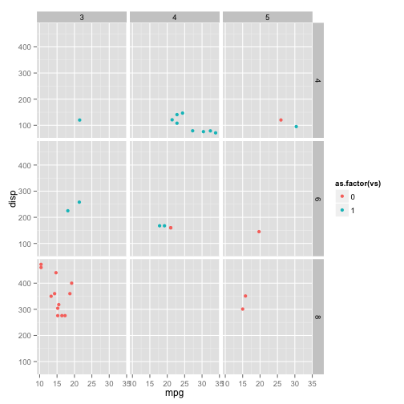

## 目录

- R的核心
- 替代For的Apply家族函数
- 管道操作
- 数据获取
- R高效数据处理
- 其他有关数据科学的topic 
- 深入了解数据:ggplot2


--- .segue .dark

## R的核心:函数式编程思想

---

## FP

```r
1+2
```

```
## [1] 3
```

```r
'+'(1,2)
```

```
## [1] 3
```

```r
funs <- c(lm, median, sd, mad, IQR)
```
- Anonymous functions 
- Closures
- List of functions

--- 


```r
summary <- function(x) {
 c(mean(x, na.rm = TRUE),
   median(x, na.rm = TRUE),
   sd(x, na.rm = TRUE),
   mad(x, na.rm = TRUE),
   IQR(x, na.rm = TRUE))
}
summary <- function(x) {
  funs <- c(mean, median, sd, mad, IQR)
  lapply(funs, function(f) f(x, na.rm = TRUE))
}
```

---

## 闭包

```r
power <- function(exponent) {
  function(x) {
    x ^ exponent
  }
}
```

---

## Lists of functions


```r
compute_mean <- list(
  base = function(x) mean(x),
  sum = function(x) sum(x) / length(x),
  manual = function(x) {
    total <- 0
    n <- length(x)
    for (i in seq_along(x)) {
      total <- total + x[i] / n
    }
    total
  }
)

compute_mean$sum()
compute_mean[["sum"]]()
```

---
## FP的效率


```r
x <- c()
system.time({
    for(i in 1:100000){
      if(i %% 2 ==0)
        x <- c(x,i)
    } 
})
```

```
##    user  system elapsed 
##   4.475   0.608   5.089
```

```r
system.time({
  x <- 1:100000
  x[x %% 2 == 0]
})
```

```
##    user  system elapsed 
##   0.002   0.001   0.003
```


--- .segue .dark

## R中的管道操作

---

## 管道操作

- shell |
- magrittr 和 pipeR(renkun)
- 上一步输出为下一步的输入
- 比管道更加灵活（主动判断应该填入的位置）
- %>% 将结果输送到函数的第一个参数
- %>>% 将结果输送到表达式中.的位置
- recharts

---

## 自定义的管道


```r
`%^_^%` <- function(from,to) {
  cat(paste(from,"smiles to",to))
}
"Ken" %^_^% "Jenny"
```

```
## Ken smiles to Jenny
```

--- 


```r
library(magrittr)
rnorm(10000,mean=10,sd=1) %>>% 
  sample(.,size=length(.)*0.1,replace=FALSE) %>% 
  log %>%
  diff %>>%
  plot(.,col="red",type="l",
    main=sprintf("length: %d",length(.)))
```

 

--- .segue .dark

## R apply家族

---

## 替代for的高效函数

- apply
- mapply
- lapply
- sapply

---

## apply(X,margin,FUN)
对对象的每一个部分施加函数

```r
apply(iris[,1:3],2,max)
```

```
## Sepal.Length  Sepal.Width Petal.Length 
##          7.9          4.4          6.9
```
也可以对高维数组操作

```r
x <- 1:27
dim(x) <- c(3,3,3)
apply(x, c(1,2), FUN = paste,collapse =",")
```

```
##      [,1]      [,2]      [,3]     
## [1,] "1,10,19" "4,13,22" "7,16,25"
## [2,] "2,11,20" "5,14,23" "8,17,26"
## [3,] "3,12,21" "6,15,24" "9,18,27"
```

---

## lapply(X,FUN)和sapply(X,FUN)
对对象的每一个元素进行操作(当对象是DF时,逐列进行)

```r
temp <- iris[,1:3]
head(sapply(temp,as.character))
```

```
##      Sepal.Length Sepal.Width Petal.Length
## [1,] "5.1"        "3.5"       "1.4"       
## [2,] "4.9"        "3"         "1.4"       
## [3,] "4.7"        "3.2"       "1.3"       
## [4,] "4.6"        "3.1"       "1.5"       
## [5,] "5"          "3.6"       "1.4"       
## [6,] "5.4"        "3.9"       "1.7"
```
借助高效的管道函数，我们可以构造出更灵活的用法

```r
sapply(1:3, . %>% seq_len %>% sum)
```

```
## [1] 1 3 6
```

---


```r
funs2 <- list(
  sum = function(x, ...) sum(x, ..., na.rm = TRUE),
  mean = function(x, ...) mean(x, ..., na.rm = TRUE),
  median = function(x, ...) median(x, ..., na.rm = TRUE)
)
lapply(funs2, function(f) f(x))
```


---
## Mapply(FUN,....,MoreArg = ,....)
- 对多个对象逐个元素进行操作(比如对DF中的多列同时操作)

```r
mapply(paste,
       1:5,letters[1:5],LETTERS[1:5],
       MoreArgs = list(sep='-'))
```

```
## [1] "1-a-A" "2-b-B" "3-c-C" "4-d-D" "5-e-E"
```
- 当函数FUN需要多个参数输入时

```r
test <- c("0","01","002")
res <- mapply(function(x, y) paste0(rep(x, y), collapse = ""), 0, 3- nchar(test))
paste0(res,test)
```

```
## [1] "000" "001" "002"
```

---
## rollapply


```r
library(zoo)
```

```
## 
## Attaching package: 'zoo'
## 
## The following objects are masked from 'package:base':
## 
##     as.Date, as.Date.numeric
```

```r
z <- rnorm(6)
rollapply(z, 2, sum)
```

```
## [1]  0.8225873  2.0785559 -0.6813391 -1.9719372 -0.4199782
```

---
## 案例1：bootstrap 抽样


```r
boot_lm <- function(formula,data,...){
    function(){
      lm(formula = formula,
         data = data[sample(nrow(data),replace = T),],...)
    }
}

iris_boot <- boot_lm(Sepal.Length ~ Petal.Length,iris)
bstrap <- sapply(X= 1:1000,
                 FUN = function(x) iris_boot()$coef)
apply(bstrap,MARGIN = 1,FUN = quantile,prob =c(0.025,0.5,0.975))
```

```
##       (Intercept) Petal.Length
## 2.5%     4.163022    0.3718770
## 50%      4.305461    0.4095615
## 97.5%    4.446607    0.4439611
```

---
## 案例2：担保链分析中的递归


```r
findCon = function(uid,friends.connected,friends.whole){
  tmp=c()
  for(i in friends.connected){
    for(j in 1:length(i)){
      tmp1 = unique(rbind(friends.whole[friends.whole$to == i[j],],friends.whole[friends.whole$from == i[j],]))
      tmp = unique(rbind(tmp,tmp1))
    }
  }
  if(dim(unique(rbind(tmp,friends.connected)))[1] == dim(friends.connected)[1]){
    return(friends.connected)
  }else {
    friends.connected=unique(rbind(tmp,friends.connected))
    findCon(uid, friends.connected,friends.whole)
  }
}
uid="20111214000138"
system.time({
friends.connected = unique(rbind(friends.whole[friends.whole$to ==uid,],friends.whole[friends.whole$from == uid,]))
friends.1=findCon(uid,friends.connected,friends.whole)
friends.1=friends.1[complete.cases(friends.1),]
})
```

---


```r
friends.whole<-read.table("data.csv",header=T,sep=",",col.names=c("from","to"))
findCon1 = function(friends.connected,friends.whole){
  index <- 1:nrow(friends.whole)
  len1 <- nrow(as.data.frame(friends.connected))
  index_target <- unique(unlist(as.list((friends.connected))))
  tmp <- sapply(friends.whole,function(x,y) y[x %in% index_target],index) %>%
                unlist() %>%
                unique()
  friends.connected <- friends.whole[tmp,]
  if(nrow(friends.connected) == len1){
    return(friends.connected)
  }else {
    findCon1(friends.connected,friends.whole)
  }
}
uid="20111214000138"
system.time({friends.1=findCon1(uid,friends.whole) %>%
            unique()
})
```

---


--- .segue .dark

## R的数据获取，web scraping

---

- XML package 结构化网页数据抓取
- rvest package(Hadley god) （非结构化网页数据抓取）

---

## 结构化网页数据抓取:XML package


```r
library(XML)
url <- 'http://www.basketball-reference.com/teams/NYK/2015_games.html' 
tables <- readHTMLTable(url,
                        stringsAsFactors = FALSE,
                        header=F)
data <- tables[[1]]
head(data,2)
```

```
##   V1                V2        V3 V4        V5 V6                  V7 V8 V9
## 1  1 Wed, Oct 29, 2014 8:00p EST    Box Score          Chicago Bulls  L   
## 2  2 Thu, Oct 30, 2014 8:00p EST    Box Score  @ Cleveland Cavaliers  W   
##   V10 V11 V12 V13 V14 V15
## 1  80 104   0   1 L 1    
## 2  95  90   1   1 W 1
```
查看网页上的超链接

```r
getHTMLLinks(url)
```

---

## 非结构化数据的获取:rvest package

[css协议](http://www.w3schools.com/cssref/css_selectors.asp)

```r
library(rvest)
freak <- html_session("http://torrentfreak.com/top-10-most-pirated-movies-of-the-week-130304/")
freak %>% 
  html_nodes(".widg-topcomments-post-title") %>% 
  html_text() %>% .[1:2]
```

```
## [1] "Transmission Releases Long-Awaited BitTorrent Client For Windows"
## [2] "Pirated ‘Star Wars: The Force Awakens’ Blu-Ray Leaks Online"
```

--- .segue .dark

## 特征工程和数据预处理

---

## reshape2

---
## 数据的两种形状

统计中待分析的数据框通常有两种形式
- 长型数据（堆叠数据），长型数据是各变量取值在一列中，而对应的变量名在另一列。
- 宽型数据（非堆叠数据），宽型数据一般是各变量取值类型一致，而变量以不同列的形式构成。

例如iris的前四列子集即是一个典型的宽型数据。例如下面将宽型数据转为长型数据：

```r
data_w <- iris[,1:4]
data_l <- stack(data_w)
data_w <- unstack(data_l)
```

---
## 数据的两种形状

只要在一列中存在分类变量，都可以将其看作是长型数据。在上例中iris的前四列可以看作是宽型数据，但最后两列可以看作是一个长型数据。可以根据Species变量将数据转为宽型。并得到各花种类的平均值。

```r
subdata <- iris[,4:5]
data_w <- unstack(subdata)
colMeans(data_w)
```

```
##     setosa versicolor  virginica 
##      0.246      1.326      2.026
```

---
## 数据重塑计算

在实践中这种单纯的长宽格式互转并不多见，因为我们并不是需要不同的数据格式，而需要不同格式下的分析结果。在上例中我们先转换数据格式再计算分析结果，而更常见的是一步直接得到分析结果。此时我们需要的是更为强大的reshape2包。

```r
library(reshape2)
dcast(data=subdata,             # 分析对象
      formula=Species~.,        # 数据分组的方式
      value.var='Petal.Width',  # 要计算的数值对象
      fun=mean)                 # 计算用函数名
```

```
##      Species     .
## 1     setosa 0.246
## 2 versicolor 1.326
## 3  virginica 2.026
```
dcast的思路和aggregate很相似，都是根据变量切分数据，再对分组后的数据进行计算，但dcast的输出格式和功能在多维情况下要方便很多。

---
## 数据重塑计算

即melt函数，将一个宽型数据融合成一个长型数据。例如我们将iris数据集进行融合。

```r
iris_long <- melt(data=iris,     # 要融合的对象
                  id='Species')  # 哪些变量不参与到融合中
```
一个纯粹的长型数据，只包含一个数值变量，其它均为分类变量。而一个纯粹的宽型数据，则不包含分类变量，均为数值变量。而现实中你遇到要处理的数据，则多半是二者的混杂，正如iris数据集那样。

---
## 数据重塑计算

melt和dcast正如同是铁匠的两种得力工具，melt可以看作是炼炉，负责融合数据，成为一个纯粹的长型。而dcast则可以看作是铁锤，负责重铸数据，使之成为需要的格式，同时加以分析。下面的例子就是将之前生成的数据进行汇总计算


```r
dcast(data=iris_long,
      formula=Species~variable,
      value.var='value',fun=mean)
```

```
##      Species Sepal.Length Sepal.Width Petal.Length Petal.Width
## 1     setosa        5.006       3.428        1.462       0.246
## 2 versicolor        5.936       2.770        4.260       1.326
## 3  virginica        6.588       2.974        5.552       2.026
```

---
## 小练习

tips数据集练习，它是一个餐厅侍者收集的关于小费的数据，其中包含了七个变量，包括总费用、付小费的金额、付款者性别、是否吸烟、日期、日间、顾客人数。计算不同性别顾客是否会支付不同的小费比例。则可以按sex变量汇集数据。

```r
dcast(tips,sex~.,value.var='tip',fun=mean)
```

```
##      sex        .
## 1 Female 2.833448
## 2   Male 3.089618
```
又或者，按sex和size变量划分数据，分别计算小费金额，可以观察到用餐人数越多时，小费相应给的越多，而且男性顾客一般会比女性顾客大方一点。

```r
dcast(tips,sex~size,value.var='tip',fun=mean)
```

```
##      sex        1        2        3        4    5    6
## 1 Female 1.276667 2.528448 3.250000 4.021111 5.14 4.60
## 2   Male 1.920000 2.614184 3.476667 4.172143 3.75 5.85
```

---
## dcast函数的使用前提

- 数据中已经存在分类变量，例如sex或者smoke
- 根据分类变量划分数据
- 再计算某个数值变量的指标

---
## 更复杂的需求

如果我们想同时计算出不同性别顾客的小费和总费用。但现有的数据集中并没有这种分类变量，怎么处理呢？

一种是笨一点的方法，将前面用过的方法用两次，然后合并这两个结果。但这种方法在多变量情况下并不好。

```r
dcast(tips,sex~.,value.var='tip',fun=mean)
```

```
##      sex        .
## 1 Female 2.833448
## 2   Male 3.089618
```

```r
dcast(tips,sex~.,value.var='total_bill',fun=mean)
```

```
##      sex        .
## 1 Female 18.05690
## 2   Male 20.74408
```

另一种推荐的方法就是使用前面提到的melt函数，先将数据融合成纯粹的长型数据，再用dcast重铸。

```r
tips_melt <- melt(data = tips, id.vars=c('sex','smoker','time','size','day'))
dcast(data = tips_melt, sex ~ variable, value.var='value',fun= mean)
```

```
##      sex total_bill      tip
## 1 Female   18.05690 2.833448
## 2   Male   20.74408 3.089618
```

---
## 更复杂的需求

要同时考虑不同性别和吸烟习惯的顾客给小费的相对例。

```r
tips_mean <- dcast(data = tips_melt, sex+ smoker~ variable, fun= mean)
tips_mean$rate <- with(tips_mean,tip/total_bill)
tips_mean
```

```
##      sex smoker total_bill      tip      rate
## 1 Female     No   18.10519 2.773519 0.1531892
## 2 Female    Yes   17.97788 2.931515 0.1630623
## 3   Male     No   19.79124 3.113402 0.1573122
## 4   Male    Yes   22.28450 3.051167 0.1369188
```

在dcast函数中的公式同时考虑到了三个分类变量，在第二步计算了小费相对于总餐费的比率，可以清楚的看到，吸烟的女性顾客相对是最大方的，而吸烟的男性则是最小气的。

---

##  时间相关数据的类别

- 时间类对象，仅包含日期和时间信息的数据
- 时间序列类对象，在一个普通的数据对象上附加了时间戳的数据

---
##  时间类对象

- 简单的Date类型，只包含日期而不包含时钟信息
- 复杂的POSIXct类型。不仅包括日期还包括了时钟和时区信息。

---
##  Date类型

数据量少的情况下，可以手工输入为字符串格式，然后转为Date类型，数据量多的话应从外部文件输入，再转为Date格式，两种方式都需要as.Date函数。

```r
date1 <- '1989-05-04'
date1 <- as.Date(date1)
class(date1)
```

```
## [1] "Date"
```

```r
date1 <- '05/04/1989'
date1 <- as.Date(date1,format='%m/%d/%Y')
```

---
##  Date类型

通常的输入格式是用短横隔开，如果是其它格式，则在as.Date函数内需要有format参数来确定。Date类数据可以进行常规的加减和比较。

```r
date2 <- date1 + 31
date2 - date1
```

```
## Time difference of 31 days
```

```r
date2 > date1
```

```
## [1] TRUE
```

---
##  Date类型

时间类数据都是从1970年1月1日作为起始点计算。例如计算从那天开始直到现在的天数。

```r
Sys.Date() - structure(0, class='Date')
```

```
## Time difference of 16899 days
```
我们也可以创建一个日期向量，并进行计算。

```r
dates <- seq(date1, length=4, by='day')
format(dates, '%w')
```

```
## [1] "4" "5" "6" "0"
```

```r
weekdays(dates)
```

```
## [1] "星期四" "星期五" "星期六" "星期日"
```
如果需要了解更多日期的格式转换，可以参见strptime函数的帮助。

---
##  POSIXct类型
POSIXct类型的数据创建和计算是类似的。


```r
time1 <- '1989-05-04'
time1 <- as.POSIXct(time1)
time1 <- "2011-03-1 01:30:00"
time1 <- as.POSIXct(time1,format="%Y-%m-%d %H:%M:%S")
time1 <- as.POSIXct("2011-03-1 01:30:00",tz='GMT')
time2 <- seq(from=time1,to=Sys.time(),by='month')
```
POSIXct类型的数据可以不包括时钟信息，或者在日期后加空格以冒号分隔时钟信息，也可以加上时区缩写。如果对输入格式有特别要求，可以使用format参数对输入格式进行设定，再行转换。

---
##  POSIXct类型

之前我们都是输入字符串再转为时间，这种方式有点繁琐，我们也可以直接从数值转为时间

```r
time1 <- ISOdatetime(2011,1,1,0,0,0)
rtimes <- ISOdatetime(2013, rep(4:5,5), sample(30,10), 0, 0, 0)
```
ISOdatetime函数能将数值转为POSIXct时间对象，六个输入数值参数分别为年、月、日、时、分、秒。上面第二行代码使用了向量化特性，随机生成了10个时间。

--- .segue .dark

## 字符串处理

---
## 字符串处理概要

在文本数据挖掘日趋重要的背景下，在处理字符这种非结构化数据时，你需要能够熟练的操作字符串对象。
- 获取字符串长度：`nchar()`
- 字符串分割：`strsplit()`
- 字符串拼接：`paste()`
- 字符串截取：`substr()`
- 字符串替代：`gsub()`
- 字符串匹配：`grep()`


---
## 获取字符串长度
nchar()能够获取字符串的长度，它也支持字符串向量操作。注意它和length()的结果是有区别的。

```r
fruit <- 'apple orange grape banana'
nchar(fruit)
```

```
## [1] 25
```

---
## 字符串分割
strsplit()负责将字符串按照某种分割形式将其进行划分，需要设定分隔符。下面我们是用空格来作为分隔符将fruit分为四个元素。

```r
strsplit(fruit,split=' ')
```

```
## [[1]]
## [1] "apple"  "orange" "grape"  "banana"
```

```r
fruitvec <- unlist(strsplit(fruit,split=' '))
```

---
## 字符串拼接
paste()负责将若干个字符串相连结，返回成单独的字符串。其优点在于，就算有的处理对象不是字符型也能自动转为字符型。另一个相似的函数paste0是设置无需分隔符的拼接。

```r
paste(fruitvec,collapse=',')
```

```
## [1] "apple,orange,grape,banana"
```

---
## 字符串截取
substr()能对给定的字符串对象取出子集，其参数是子集所处的起始和终止位置。

```r
substr(fruit, 1,5)
```

```
## [1] "apple"
```

---
## 字符串替代
gsub()负责搜索字符串的特定表达式，并用新的内容加以替代。sub()函数是类似的，但只替代第一个发现结果。

```r
gsub('apple','strawberry',fruit)
```

```
## [1] "strawberry orange grape banana"
```

---
## 字符串匹配
grep()负责搜索给定字符串对象中特定表达式 ，并返回其位置索引。grepl()函数与之类似，但其后面的"l"则意味着返回的将是逻辑值。

```r
grep('grape',fruitvec)
```

```
## [1] 3
```


---

## dplyr([hadley](http://hadley.nz/))

---

- filter() (and slice())
- arrange()
- select() (and rename())
- distinct()
- mutate() (and transmute())
- summarise()
- sample_n() and sample_frac()

---

```r
library(nycflights13)
dim(flights)
```

```
## [1] 336776     16
```

```r
#> [1] 336776     16
head(flights)
```

```
## Source: local data frame [6 x 16]
## 
##    year month   day dep_time dep_delay arr_time arr_delay carrier tailnum
##   (int) (int) (int)    (int)     (dbl)    (int)     (dbl)   (chr)   (chr)
## 1  2013     1     1      517         2      830        11      UA  N14228
## 2  2013     1     1      533         4      850        20      UA  N24211
## 3  2013     1     1      542         2      923        33      AA  N619AA
## 4  2013     1     1      544        -1     1004       -18      B6  N804JB
## 5  2013     1     1      554        -6      812       -25      DL  N668DN
## 6  2013     1     1      554        -4      740        12      UA  N39463
## Variables not shown: flight (int), origin (chr), dest (chr), air_time
##   (dbl), distance (dbl), hour (dbl), minute (dbl)
```

---
## filter() 和slice()

```r
filter(flights, month == 1, day == 1)
```

```
## Source: local data frame [842 x 16]
## 
##     year month   day dep_time dep_delay arr_time arr_delay carrier tailnum
##    (int) (int) (int)    (int)     (dbl)    (int)     (dbl)   (chr)   (chr)
## 1   2013     1     1      517         2      830        11      UA  N14228
## 2   2013     1     1      533         4      850        20      UA  N24211
## 3   2013     1     1      542         2      923        33      AA  N619AA
## 4   2013     1     1      544        -1     1004       -18      B6  N804JB
## 5   2013     1     1      554        -6      812       -25      DL  N668DN
## 6   2013     1     1      554        -4      740        12      UA  N39463
## 7   2013     1     1      555        -5      913        19      B6  N516JB
## 8   2013     1     1      557        -3      709       -14      EV  N829AS
## 9   2013     1     1      557        -3      838        -8      B6  N593JB
## 10  2013     1     1      558        -2      753         8      AA  N3ALAA
## ..   ...   ...   ...      ...       ...      ...       ...     ...     ...
## Variables not shown: flight (int), origin (chr), dest (chr), air_time
##   (dbl), distance (dbl), hour (dbl), minute (dbl)
```


```r
slice(flights,1:10)
```


---
## arrange

```r
arrange(flights, year, month, day)
```

```
## Source: local data frame [336,776 x 16]
## 
##     year month   day dep_time dep_delay arr_time arr_delay carrier tailnum
##    (int) (int) (int)    (int)     (dbl)    (int)     (dbl)   (chr)   (chr)
## 1   2013     1     1      517         2      830        11      UA  N14228
## 2   2013     1     1      533         4      850        20      UA  N24211
## 3   2013     1     1      542         2      923        33      AA  N619AA
## 4   2013     1     1      544        -1     1004       -18      B6  N804JB
## 5   2013     1     1      554        -6      812       -25      DL  N668DN
## 6   2013     1     1      554        -4      740        12      UA  N39463
## 7   2013     1     1      555        -5      913        19      B6  N516JB
## 8   2013     1     1      557        -3      709       -14      EV  N829AS
## 9   2013     1     1      557        -3      838        -8      B6  N593JB
## 10  2013     1     1      558        -2      753         8      AA  N3ALAA
## ..   ...   ...   ...      ...       ...      ...       ...     ...     ...
## Variables not shown: flight (int), origin (chr), dest (chr), air_time
##   (dbl), distance (dbl), hour (dbl), minute (dbl)
```

---
## select() (and rename())

```r
select(flights, year:month, day)
```

```
## Source: local data frame [336,776 x 3]
## 
##     year month   day
##    (int) (int) (int)
## 1   2013     1     1
## 2   2013     1     1
## 3   2013     1     1
## 4   2013     1     1
## 5   2013     1     1
## 6   2013     1     1
## 7   2013     1     1
## 8   2013     1     1
## 9   2013     1     1
## 10  2013     1     1
## ..   ...   ...   ...
```

```r
rename(flights, tail_num = tailnum)
```

```
## Source: local data frame [336,776 x 16]
## 
##     year month   day dep_time dep_delay arr_time arr_delay carrier
##    (int) (int) (int)    (int)     (dbl)    (int)     (dbl)   (chr)
## 1   2013     1     1      517         2      830        11      UA
## 2   2013     1     1      533         4      850        20      UA
## 3   2013     1     1      542         2      923        33      AA
## 4   2013     1     1      544        -1     1004       -18      B6
## 5   2013     1     1      554        -6      812       -25      DL
## 6   2013     1     1      554        -4      740        12      UA
## 7   2013     1     1      555        -5      913        19      B6
## 8   2013     1     1      557        -3      709       -14      EV
## 9   2013     1     1      557        -3      838        -8      B6
## 10  2013     1     1      558        -2      753         8      AA
## ..   ...   ...   ...      ...       ...      ...       ...     ...
## Variables not shown: tail_num (chr), flight (int), origin (chr), dest
##   (chr), air_time (dbl), distance (dbl), hour (dbl), minute (dbl)
```

---
## distinct()

```r
distinct(select(flights, tailnum))
```

```
## Source: local data frame [4,044 x 1]
## 
##    tailnum
##      (chr)
## 1   N14228
## 2   N24211
## 3   N619AA
## 4   N804JB
## 5   N668DN
## 6   N39463
## 7   N516JB
## 8   N829AS
## 9   N593JB
## 10  N3ALAA
## ..     ...
```

---
## mutate() (and transmute())

```r
mutate(flights,
  gain = arr_delay - dep_delay,
  gain_per_hour = gain / (air_time / 60)
)
```

```
## Source: local data frame [336,776 x 18]
## 
##     year month   day dep_time dep_delay arr_time arr_delay carrier tailnum
##    (int) (int) (int)    (int)     (dbl)    (int)     (dbl)   (chr)   (chr)
## 1   2013     1     1      517         2      830        11      UA  N14228
## 2   2013     1     1      533         4      850        20      UA  N24211
## 3   2013     1     1      542         2      923        33      AA  N619AA
## 4   2013     1     1      544        -1     1004       -18      B6  N804JB
## 5   2013     1     1      554        -6      812       -25      DL  N668DN
## 6   2013     1     1      554        -4      740        12      UA  N39463
## 7   2013     1     1      555        -5      913        19      B6  N516JB
## 8   2013     1     1      557        -3      709       -14      EV  N829AS
## 9   2013     1     1      557        -3      838        -8      B6  N593JB
## 10  2013     1     1      558        -2      753         8      AA  N3ALAA
## ..   ...   ...   ...      ...       ...      ...       ...     ...     ...
## Variables not shown: flight (int), origin (chr), dest (chr), air_time
##   (dbl), distance (dbl), hour (dbl), minute (dbl), gain (dbl),
##   gain_per_hour (dbl)
```

---
## summarise() 
- n()
- sum()
- mean()


```r
summarise(flights,
  delay = mean(dep_delay, na.rm = TRUE))
```

```
## Source: local data frame [1 x 1]
## 
##      delay
##      (dbl)
## 1 12.63907
```

---

##sample_n() and sample_frac()

```r
sample_n(flights, 0.01)
```

---
## group operations

```r
by_tailnum <- group_by(flights, tailnum)
delay <- summarise(by_tailnum,
  count = n(),
  dist = mean(distance, na.rm = TRUE),
  delay = mean(arr_delay, na.rm = TRUE))
delay <- filter(delay, count > 20, dist < 2000)
```

---
## chain


```r
flights %>%
  group_by(year, month, day) %>%
  select(arr_delay, dep_delay) %>%
  summarise(
    arr = mean(arr_delay, na.rm = TRUE),
    dep = mean(dep_delay, na.rm = TRUE)
  ) %>%
  filter(arr > 30 | dep > 30) %>%
  head(3)
```

```
## Source: local data frame [3 x 5]
## Groups: year, month [2]
## 
##    year month   day      arr      dep
##   (int) (int) (int)    (dbl)    (dbl)
## 1  2013     1    16 34.24736 24.61287
## 2  2013     1    31 32.60285 28.65836
## 3  2013     2    11 36.29009 39.07360
```

---
## 窗口函数
- ranking and ordering funtions 
  - row_number(),min_rank(),dense_rank(),cume_dist(),percent_rank(),ntail()
  - lead(),lag()
- 累计聚合函数
  - cumsum(),cummin(),cummax(),cumall(),cumany(),cummean(),n(),sum()

---

```r
library(Lahman)
batting <- select(tbl_df(Batting), playerID, yearID, teamID, G, AB:H) 
batting <- arrange(batting, playerID, yearID, teamID)
players <- group_by(batting, playerID)

# 找出每一位选手击球次数最多的两年
filter(players, min_rank(desc(H)) <= 2 & H > 0)
# 对于每一位选手，按照每年参加过的比赛次数排序
mutate(players, G_rank = min_rank(G))

# 对于每一位选手，找出比去年表现好的年份
filter(players, G > lag(G))
```

--- .segue .dark

## 数据科学中的其他课题

---
## 缺失值处理和异常值检测

- mice和outlier
- 缺失值处理
  - 缺失的原因：误输入，异常值，特殊值
  - 数据分布的特性
  - 删除、插补、回归拟合
- 异常值检测
  - 噪音
  - 特殊值

--- .segue .dark

## 直观的了解数据:ggplot2

---


```r
library(ggplot2)
ggplot(mpg,aes(hwy,cty)) +
  geom_point(aes(color =as.factor(cyl))) +
  geom_smooth(method = 'lm') +
  coord_cartesian()+
  theme_bw()
```

 

---


```r
ggplot(mpg,aes(hwy,cty)) +
  geom_point(aes(color =as.factor(cyl))) +
  geom_smooth(aes(color = as.factor(cyl)),method = 'lm')
```

 

---

- ggplot(data,aes(x,y,...))
- geom_*(data,aes(x,y,color,fill,shape,size,...))
  - geom_histgram(binwidth =5)
  - geom_bar(stat= "identity",postion = c("dodge","stack","fill"))
  - geom_point()
  - geom_text(aes(label))
  - geom_boxplot()
- facet_*(formula) 分面（按网格画图）
  - facet_grid(x~y) 
  - facet_warp(~x)
  


---


```r
ggplot(mtcars) +
  geom_histogram(aes(mpg),binwidth = 2)
```

 

---


```r
ggplot(mtcars) + 
  geom_bar(aes(as.factor(cyl),fill = as.factor(gear)))
```

 

---


```r
ggplot(mtcars) + 
  geom_bar(aes(as.factor(cyl),fill = as.factor(gear)),position = "fill")
```

 

---


```r
data <- table(as.factor(mtcars$cyl),as.factor(mtcars$gear))
data 
```

```
##    
##      3  4  5
##   4  1  8  2
##   6  2  4  1
##   8 12  0  2
```

```r
data <- as.data.frame(data)
head(data)
```

```
##   Var1 Var2 Freq
## 1    4    3    1
## 2    6    3    2
## 3    8    3   12
## 4    4    4    8
## 5    6    4    4
## 6    8    4    0
```

---


```r
ggplot(data) + 
  geom_bar(aes(x= Var1,y = Freq,fill =Var2),stat = "identity")
```

 

---


```r
ggplot(mtcars) +
  geom_boxplot(aes(x = as.factor(cyl),y = mpg))
```

 

---


```r
ggplot(mtcars) +
  geom_point(aes(x = mpg,y = disp,color = as.factor(vs))) +
  facet_grid(cyl~gear)
```

 


  


